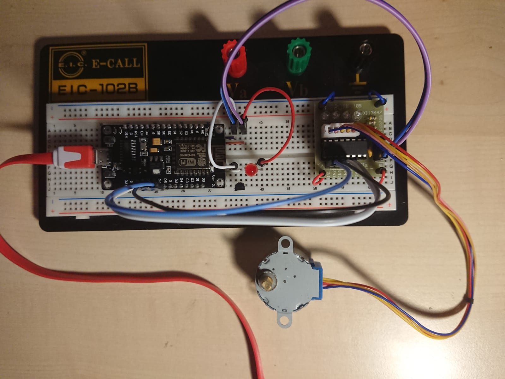

# NodeMCU_V3
Playground all around NodeMCU_V3

I use:
* esptool to burn the firmware to NodeMCU
* Firmware, derived from: https://nodemcu-build.com/
* esplorer (https://esp8266.ru/esplorer/)

So far I played with some small scripts:
## wifi scanner
[wifiscan.lua](lua/wifiscan.lua)

## LED blinking
[blink_led.lua](lua/blink_led.lua)  

## Stepper motor 
[motor.lua](lua/motor.lua)

All in one:

* GND and V_USB are connected under the PCB and available right-top of PCB.
* D2 is used as signal of the LED. ALso taken from under PCB and connected to basis of NPN-bip.
* bip collector connects LED connects V_USB
* bip emitter connects GND
* Stepper-driver (ULN2003) takes 5V from V_USB and shares GND.
* Stepper-signals are taken on top of PCB D5, D6, D7, D8.
* Power (and data) is taken by micro-usb from my laptop. 
